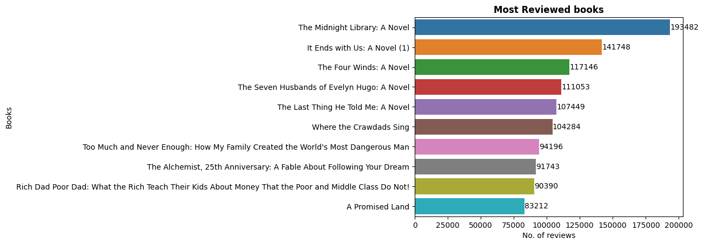

# Best Selling Novels 2009 - 2021 of Amazon

-----

Books have been the medium of knowledge flow from one generation to it's next. There are around 1 million books published in each year (excluding the self-published authors), but a few of them make their way to the list of Best Sellers. There are books that stays for years and each time they are opened feels anew. And, here we'll explore some of best selling novels of Amazon from 2009 to 2021.

- [Pandas Analysis Notebook](https://github.com/dSilu/Best_Selling_Books_of_Amazon/blob/main/bestselling%20books%20analysis.ipynb)
- [SQL(MySQL) Analysis Script](https://github.com/dSilu/Best_Selling_Books_of_Amazon/blob/main/analysis.sql)

You can read the notebook @[NBViewer](https://nbviewer.org/github/dSilu/Best_Selling_Books_of_Amazon/blob/main/bestselling%20books%20analysis.ipynb)

Made with ❤️ - [Ashrulochan Sahoo](https://github.com/dSilu)